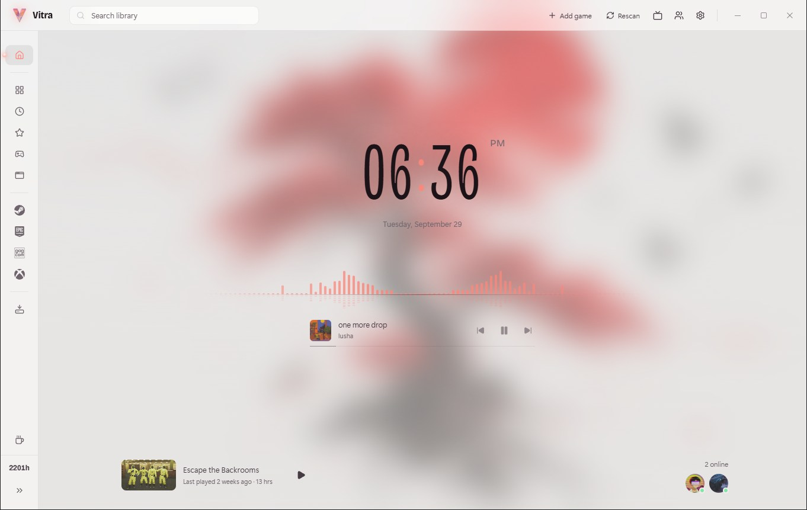

<p align="center">
  
</p>

<h1 align="center">Vitra</h1>

<p align="center">
  One library for all your PC games.<br />
  Steam, Epic, GOG, Xbox and anything else you play, in one quiet place.
</p>

<p align="center">
  <a href="https://github.com/MindlZ/Vitra/releases/latest"></a>
  <a href="https://github.com/MindlZ/Vitra/releases"></a>
  
  <a href="LICENSE"></a>
</p>

<p align="center">
  <a href="https://github.com/MindlZ/Vitra/releases/latest"><b>Download</b></a>
  ·
  <a href="#getting-started">Getting started</a>
  ·
  <a href="docs/how-it-works.md">How it works</a>
  ·
  <a href="https://ko-fi.com/mindlz">Support</a>
</p>

<p align="center">
  
</p>

---

## About

Vitra is a game launcher for Windows. It finds the games you already have,
installed or not, across every store on your PC, and puts them in one library.
It keeps track of how long you play, shows which friends are online, and has a
fullscreen big picture mode for playing on a TV with a controller.

It reads the files your launchers already keep on disk. There are no accounts
to make and nothing to sign in to. Steam, Epic, GOG and Xbox still launch your
games, so ownership, cloud saves and anti-cheat work exactly as they normally do.

## Features

- **Every store in one library.** Installed and owned Steam games, Steam
  shortcuts, Epic, GOG, Xbox / Game Pass, and any `.exe` you add yourself.
  Games you own but haven't installed show up too, ready to install.
- **Playtime tracking.** Time played, sessions and last played, for every game,
  including ones Steam never tracked. Steam's own hours are imported on first run.
- **Cover art, automatically.** Pulled from Steam, your custom Steam artwork, and
  SteamGridDB, with your own images as an option.
- **Big picture mode.** Fullscreen and controller-first, with power options to
  sleep, restart or shut down the PC from the couch.
- **Controller support** throughout the app, not just in big picture.
- **Friends.** See which Steam friends are online and what they're playing.
- **Captures.** Your Steam screenshots and Xbox Game Bar captures, on each game's page.
- **Now playing.** What's playing on your PC, with a visualiser, on the home screen.
- **Discord status.** Show the game you're playing on your Discord profile.
- **Your look.** Pick any wallpaper and Vitra takes its colours from it.
- **Favourites, tags, search and a Programs tab** for apps like Wallpaper Engine.
- **Automatic updates** from this repository's releases.

## Screenshots

<table>
  <tr>
    <td width="50%"></td>
    <td width="50%"></td>
  </tr>
  <tr>
    <td align="center"><sub>Every store in one library</sub></td>
    <td align="center"><sub>Playtime and details for each game</sub></td>
  </tr>
  <tr>
    <td width="50%"></td>
    <td width="50%"></td>
  </tr>
  <tr>
    <td align="center"><sub>Big picture mode, for the TV and a controller</sub></td>
    <td align="center"><sub>Big picture home</sub></td>
  </tr>
</table>

### Wallpapers

Four to choose from, or use your own. The whole app takes its colours from
whichever you pick, and switches to a light or dark look to suit it.

<table>
  <tr>
    <td width="50%"></td>
    <td width="50%"></td>
  </tr>
  <tr>
    <td align="center"><sub>Sunset · dark</sub></td>
    <td align="center"><sub>Smoke · light</sub></td>
  </tr>
  <tr>
    <td width="50%"></td>
    <td width="50%"></td>
  </tr>
  <tr>
    <td align="center"><sub>Moon · dark</sub></td>
    <td align="center"><sub>Tree · light</sub></td>
  </tr>
</table>

<p align="center">
  
</p>

## Getting started

### Install

1. Download `Vitra-Setup-<version>.exe` from the
   [latest release](https://github.com/MindlZ/Vitra/releases/latest).
2. Run it. Windows SmartScreen may warn you because the installer isn't
   code-signed (certificates cost money this project doesn't have). Click
   **More info → Run anyway**.
3. Choose where to install and whether it's just for you or everyone on the PC.

Vitra scans your stores the first time it opens. Everything works without any
of the optional setup below.

### Steam friends (optional)

To see which friends are online, Vitra needs a free Steam Web API key.

1. Go to [steamcommunity.com/dev/apikey](https://steamcommunity.com/dev/apikey)
   and sign in.
2. Enter any domain name (`localhost` is fine), accept the terms and copy the key.
3. In Vitra, open **Settings → Connections** and paste it into **Steam Web API key**.

Your **friends list** has to be public for Steam to share it: Steam → your
profile → **Edit Profile → Privacy Settings → Friends List: Public**.

The key is encrypted with your Windows account before it's saved, and is only
ever sent to Steam.

### Cover art for non-Steam games (optional)

Steam games get their art automatically. For Epic, GOG, Xbox, shortcuts and
games you add yourself, a free SteamGridDB key fills in the gaps.

1. Sign in at [steamgriddb.com](https://www.steamgriddb.com) (you can use your
   Steam account).
2. Open [Preferences → API](https://www.steamgriddb.com/profile/preferences/api)
   and generate a key.
3. Paste it into **Settings → Connections → SteamGridDB key**.

You can also set any image as a game's cover or background from its page.

### Discord status (optional)

1. Turn on **Settings → Connections → Show what you're playing**.
2. Make sure the **Discord desktop app** is running (the browser version can't
   receive it).
3. In Discord, open **User Settings → Activity Privacy** and turn on **Share
   your detected activities with others**.

Your status then shows the game while it's running, if you launched it from
Vitra.

### Captures

Nothing to set up. Screenshots you take with Steam (**F12**) or the Xbox Game
Bar (**Win + Alt + PrtScn**, or clips with **Win + Alt + G**) appear on that
game's page.

### Big picture and controllers

Open big picture with the **TV button** in the title bar, **F11**, or the
**View** button on your controller. It can also start that way: **Settings →
General → Start in big picture**.

| Button | Does |
| ------ | ---- |
| A | Play / select |
| B | Back |
| X | Game details |
| Y | Favourite |
| LB / RB | Switch tabs |
| Menu | Settings |
| View | Leave big picture |

Xbox controllers work out of the box. The Xbox button itself is reserved by
Windows for the Game Bar.

### Starting with Windows

**Settings → General → Start with Windows** starts Vitra quietly in the tray
when you sign in. Closing the window keeps it in the tray so playtime keeps
tracking; quit from the tray icon.

## About me


Hi, I'm **MindlZ**. Vitra started as the launcher I wanted for my own PC: every
game in one place, and nice to look at while it's doing it. I'm sharing it in
case it's what you were after too.

If Vitra has earned a spot on your PC, you can
[buy me a coffee on Ko-fi](https://ko-fi.com/mindlz). It's never expected, but
always appreciated.

<br clear="left" />

## A personal project

Vitra is something I build in my spare time, for myself first and for anyone
else who finds it useful. Updates and bug fixes happen when I have the time
for them, so please don't expect quick replies to issues or feature requests.
I do read them, and good bug reports are always appreciated.

It's released under the [GNU General Public License v3.0](LICENSE). That means
it's free and open source, and anyone can use, study, change and share it. If
you fork it and release your own version, it has to stay open source under the
same licence, with its source code available. Contributions are welcome, here
or in your own fork.

## A word of caution about forks

Because Vitra is open source, anyone can take the code, change it and publish
their own version. Most people who do that mean well, but not all of them.

A launcher sees your whole game library and runs programs on your PC, which
makes a tampered copy an easy way to slip in trackers or malware. Be careful:

- Get Vitra from **[this repository's releases](https://github.com/MindlZ/Vitra/releases)**.
- Don't install a fork or a re-upload you found somewhere else unless you trust
  who made it and can see its source.
- Be wary of any "Vitra" that asks you to sign in to an account, asks for
  passwords, or comes bundled with other software. This one never does.

## Building from source

You'll need [Node.js](https://nodejs.org) 22 or newer, on Windows.

```bash
npm install
npm run dev    # run it with hot reload
npm run dist   # build the installer into dist/
```

Updates only work in the installed app, not when running from source.
Publishing a release is covered in [How it works](docs/how-it-works.md#updates-and-releases).

## Licence

Vitra is made by MindlZ and released under the [GNU General Public License v3.0](LICENSE).
